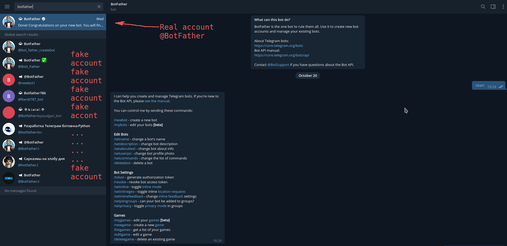
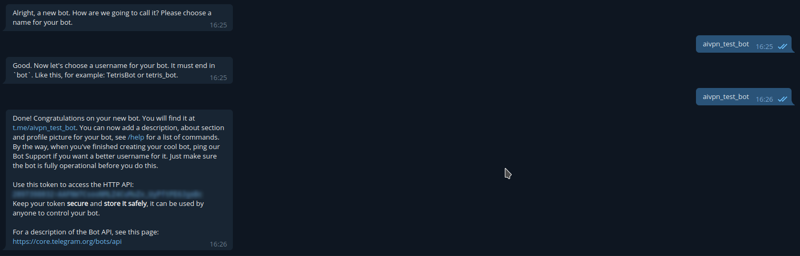

# telegram bot skel for vpn certificates distribution

Very simple bot to allow certificates distribution over telegram

# Installation 

1. Install telegram-bot

```
pip install python-telegram-bot --upgrade
```

2. Create a bot using telegram BotFather. Be sure you are using the @BotFather account. Other bots will steal your API token and could gain access to your bot.





3. Clone this repo
```
git clone https://github.com/jwackito/telegram-bot-aivpn.git
```

4. Replace the variable `token = 'TOKEN-PROVIDED-BY-BOTFATHER'` with the providen token.

5. Run the script. The bot will be responsive while the script is up.
```
python aivpn-telegram-bot.py
```

# Try your bot
Search for your bot in telegram's contact search bar. Once you find it, send it a /start message to receive instructions.

The /start message executes the start function of the aivpn-telegram-bot.py script.

The actual version supports 2 commands, `/getopenvpn` and `/getwireguard`. Each command executes the `getopenvpn` or `getwireguard` function.

If other command is sent, the script will execute the `unknown` funtion and will print the instructions.

Other text that is not a command will be ignored by the bot. To create new commands, simply add new functions, and the add them to the `dispatcher` object as a `CommandHandler` object.

The `updater.start\_polling()` function will poll new commands from users. The `updater.start_polling()` call will wait till CTRL-C is pressed or some other event and then finish the bot gracefully.
